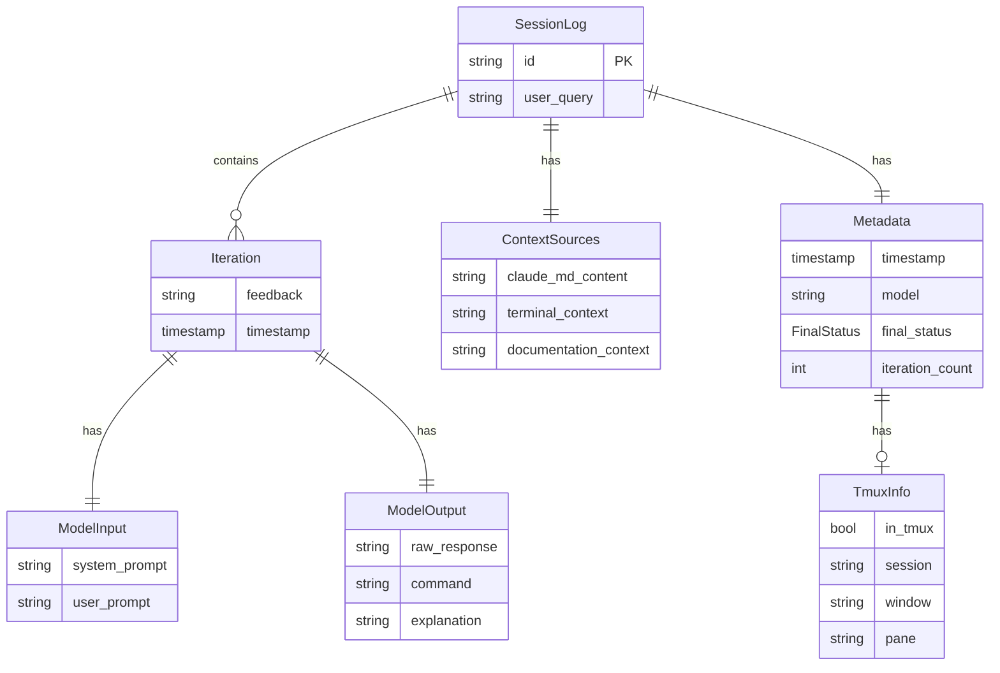

# Data Models

> Last updated: 2026-02-01

## Entity Relationship Diagram



## Go Structs

### Claude Package (`internal/claude/`)

```go
// Response from Claude API (JSON schema output)
type Response struct {
    Command     string `json:"command"`
    Explanation string `json:"explanation"`
}

// Result of a generation call
type GenerateResult struct {
    Response     *Response
    SystemPrompt string
    UserPrompt   string
    RawOutput    string
}
```

### Logging Package (`internal/logging/`)

```go
// Full session log stored to disk
type SessionLog struct {
    ID             string         `json:"id"`
    UserQuery      string         `json:"user_query"`
    ContextSources ContextSources `json:"context_sources"`
    Iterations     []Iteration    `json:"iterations"`
    Metadata       Metadata       `json:"metadata"`
}

// Context gathered before generation
type ContextSources struct {
    ClaudeMdContent      string `json:"claude_md_content"`
    TerminalContext      string `json:"terminal_context"`
    DocumentationContext string `json:"documentation_context"`
}

// Single generation iteration (initial + refinements)
type Iteration struct {
    Feedback    string      `json:"feedback"`
    ModelInput  ModelInput  `json:"model_input"`
    ModelOutput ModelOutput `json:"model_output"`
    Timestamp   time.Time   `json:"timestamp"`
}

type ModelInput struct {
    SystemPrompt string `json:"system_prompt"`
    UserPrompt   string `json:"user_prompt"`
}

type ModelOutput struct {
    RawResponse string `json:"raw_response"`
    Command     string `json:"command"`
    Explanation string `json:"explanation"`
}

// Session metadata
type Metadata struct {
    Timestamp      time.Time   `json:"timestamp"`
    Model          string      `json:"model"`
    FinalStatus    FinalStatus `json:"final_status"`
    IterationCount int         `json:"iteration_count"`
    TmuxInfo       TmuxInfo    `json:"tmux_info"`
}

type FinalStatus string // "accepted", "rejected", "quit"

// Summary for log listing
type LogSummary struct {
    ID             string      `json:"id"`
    UserQuery      string      `json:"user_query"`
    FinalStatus    FinalStatus `json:"final_status"`
    Model          string      `json:"model"`
    Timestamp      time.Time   `json:"timestamp"`
    IterationCount int         `json:"iteration_count"`
    CommandPreview string      `json:"command_preview"`
}
```

### Terminal Package (`internal/terminal/`)

```go
type TmuxInfo struct {
    InTmux  bool   `json:"in_tmux"`
    Session string `json:"session,omitempty"`
    Window  string `json:"window,omitempty"`
    Pane    string `json:"pane,omitempty"`
}
```

### Build Tools Package (`internal/buildtools/`)

```go
// Parser interface for build tool detection
type Parser interface {
    FileName() string
    Parse(content []byte) (*Tool, error)
}

// Detected build tool
type Tool struct {
    Name     string    // e.g., "Makefile", "npm"
    File     string    // Path to config file
    Commands []Command
}

// Available command in a build tool
type Command struct {
    Name        string
    Description string
}

// Result of directory scan
type DetectionResult struct {
    Tools []*Tool
}
```

### Config Package (`internal/config/`)

```go
type Config struct {
    Model       string
    ClaudeMdDir string
}
```

### Docs Package (`internal/docs/`)

```go
type DocFile struct {
    Path    string
    Content string
    Size    int64
}

type DetectionResult struct {
    Files []DocFile
}
```

## TypeScript Interfaces (`web/src/types/`)

```typescript
interface TmuxInfo {
    in_tmux: boolean;
    session?: string;
    window?: string;
    pane?: string;
}

interface ModelInput {
    system_prompt: string;
    user_prompt: string;
}

interface ModelOutput {
    raw_response: string;
    command: string;
    explanation: string;
}

interface Iteration {
    feedback: string;
    model_input: ModelInput;
    model_output: ModelOutput;
    timestamp: string;
}

interface ContextSources {
    claude_md_content: string;
    terminal_context: string;
    documentation_context: string;
}

interface Metadata {
    timestamp: string;
    model: string;
    final_status: 'accepted' | 'rejected' | 'quit';
    iteration_count: number;
    tmux_info: TmuxInfo;
}

interface SessionLog {
    id: string;
    user_query: string;
    context_sources: ContextSources;
    iterations: Iteration[];
    metadata: Metadata;
}

interface LogSummary {
    id: string;
    user_query: string;
    final_status: 'accepted' | 'rejected' | 'quit';
    model: string;
    timestamp: string;
    iteration_count: number;
    command_preview: string;
}

interface FilterParams {
    status?: string;
    model?: string;
    search?: string;
    from?: string;
    to?: string;
    sort?: string;
    order?: 'asc' | 'desc';
    limit?: number;
    offset?: number;
}
```

## JSON Schema (Claude API)

Used with `claude --json-schema` for structured output:

```json
{
    "type": "object",
    "properties": {
        "command": {
            "type": "string",
            "description": "The exact shell command to execute"
        },
        "explanation": {
            "type": "string",
            "description": "Breakdown of the tools and flags used"
        }
    },
    "required": ["command", "explanation"]
}
```

## Storage Format

### Log File (`~/.local/share/cmd/logs/{timestamp-id}.json`)

```json
{
    "id": "2026-02-01T10-30-00-abc123",
    "user_query": "list all go files recursively",
    "context_sources": {
        "claude_md_content": "# Preferences\n- Use modern CLI tools",
        "terminal_context": "$ pwd\n/Users/user/project\n$ ls\ngo.mod  main.go",
        "documentation_context": "# README\nThis is a Go project..."
    },
    "iterations": [
        {
            "feedback": "",
            "model_input": {
                "system_prompt": "You are a CLI command generator...",
                "user_prompt": "Generate: list all go files recursively"
            },
            "model_output": {
                "raw_response": "{\"command\":\"fd -e go\",\"explanation\":\"...\"}",
                "command": "fd -e go",
                "explanation": "Uses fd to find files with .go extension"
            },
            "timestamp": "2026-02-01T10:30:00Z"
        }
    ],
    "metadata": {
        "timestamp": "2026-02-01T10:30:00Z",
        "model": "claude-sonnet-4-20250514",
        "final_status": "accepted",
        "iteration_count": 1,
        "tmux_info": {
            "in_tmux": true,
            "session": "dev",
            "window": "0",
            "pane": "0"
        }
    }
}
```
