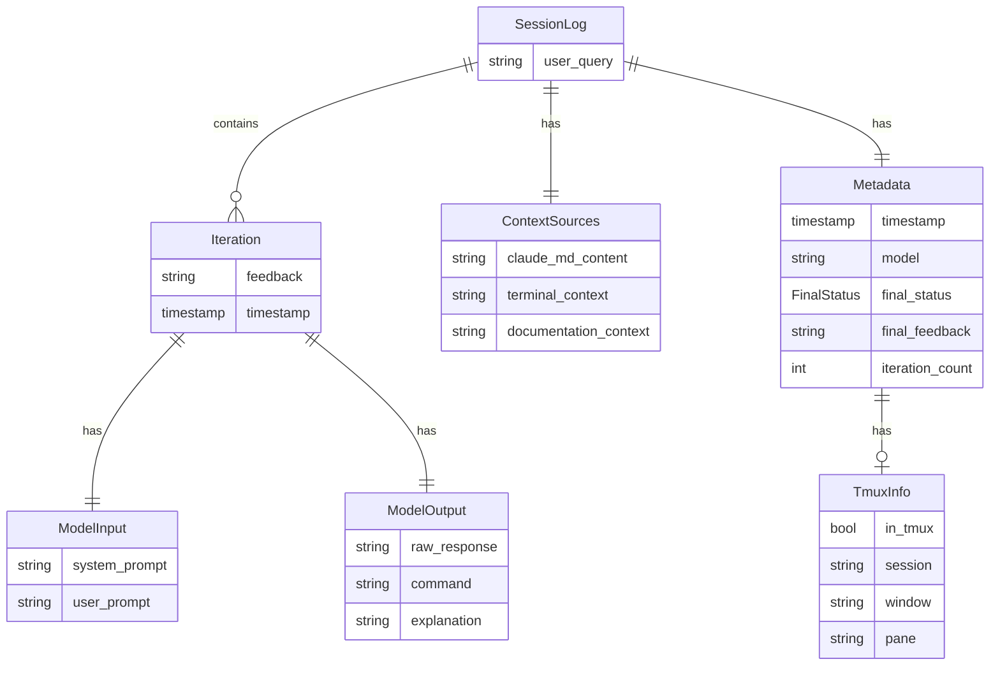

# Data Models

> Last updated: 2026-02-13

## Entity Relationship Diagram



## Go Structs

### Claude Package (`internal/claude/`)

```go
// Response from Claude API (JSON schema output)
type Response struct {
    Command     string `json:"command"`
    Explanation string `json:"explanation"`
}

// Outer JSON response from claude CLI
type ClaudeResponse struct {
    Result           string    `json:"result"`
    StructuredOutput *Response `json:"structured_output"`
    Error            bool      `json:"is_error"`
}

// Result of a generation call (includes prompts for logging)
type GenerateResult struct {
    Response     *Response
    SystemPrompt string
    UserPrompt   string
    RawOutput    string
}
```

### Logging Package (`internal/logging/`)

```go
// Full session log stored to disk
type SessionLog struct {
    UserQuery      string         `json:"user_query"`
    ContextSources ContextSources `json:"context_sources"`
    Iterations     []Iteration    `json:"iterations"`
    Metadata       Metadata       `json:"metadata"`
}

// Wrapper that adds ID for API responses
type SessionLogWithID struct {
    ID string `json:"id"`
    SessionLog
}

// Context gathered before generation
type ContextSources struct {
    ClaudeMdContent      string `json:"claude_md_content"`
    TerminalContext      string `json:"terminal_context"`
    DocumentationContext string `json:"documentation_context"`
}

// Single generation iteration (initial + refinements)
type Iteration struct {
    Feedback    string      `json:"feedback"`
    ModelInput  ModelInput  `json:"model_input"`
    ModelOutput ModelOutput `json:"model_output"`
    Timestamp   time.Time   `json:"timestamp"`
}

type ModelInput struct {
    SystemPrompt string `json:"system_prompt"`
    UserPrompt   string `json:"user_prompt"`
}

type ModelOutput struct {
    RawResponse string `json:"raw_response"`
    Command     string `json:"command"`
    Explanation string `json:"explanation"`
}

// Session metadata
type Metadata struct {
    Timestamp      time.Time       `json:"timestamp"`
    Model          string          `json:"model"`
    FinalStatus    FinalStatus     `json:"final_status"`
    FinalFeedback  string          `json:"final_feedback,omitempty"`
    IterationCount int             `json:"iteration_count"`
    TmuxInfo       terminal.TmuxInfo `json:"tmux_info"`
}

type FinalStatus string // "accepted", "rejected", "quit"

// Summary for log listing
type LogSummary struct {
    ID             string      `json:"id"`
    UserQuery      string      `json:"user_query"`
    FinalStatus    FinalStatus `json:"final_status"`
    Model          string      `json:"model"`
    Timestamp      time.Time   `json:"timestamp"`
    IterationCount int         `json:"iteration_count"`
    CommandPreview string      `json:"command_preview"`
    TmuxSession    string      `json:"tmux_session,omitempty"`
}
```

### Terminal Package (`internal/terminal/`)

```go
type TmuxInfo struct {
    InTmux  bool   `json:"in_tmux"`
    Session string `json:"session,omitempty"`
    Window  string `json:"window,omitempty"`
    Pane    string `json:"pane,omitempty"`
}
```

### Build Tools Package (`internal/buildtools/`)

```go
// Parser interface for build tool detection
type Parser interface {
    FileName() string
    Parse(content []byte) (*Tool, error)
}

// Detected build tool
type Tool struct {
    Name     string    `json:"name"`
    File     string    `json:"file"`
    Commands []Command `json:"commands"`
}

// Available command in a build tool
type Command struct {
    Name        string `json:"name"`
    Description string `json:"description,omitempty"`
}

// Result of directory scan
type DetectionResult struct {
    Tools []Tool `json:"tools"`
}
```

### Config Package (`internal/config/`)

```go
type Config struct {
    Model       string
    ClaudeMdDir string
}
```

### Docs Package (`internal/docs/`)

```go
// Extracted command-related section from documentation
type Section struct {
    Heading string // The heading text
    Content string // Full section content including code blocks
    Source  string // Source file (README.md, CLAUDE.md, etc.)
}

// All extracted documentation sections
type Result struct {
    Sections []Section
}
```

## JSON Schema (Claude API)

Used with `claude --json-schema` for structured output:

```json
{
    "type": "object",
    "properties": {
        "command": {
            "type": "string",
            "description": "The exact shell command to execute"
        },
        "explanation": {
            "type": "string",
            "description": "A breakdown explaining each tool, argument, and flag used"
        }
    },
    "required": ["command", "explanation"]
}
```

## Storage Format

### Log File (`~/.local/share/cmd/logs/{timestamp}.json`)

Filename format: `2026-02-01T14-30-45Z.json` (UTC timestamp, colons replaced with hyphens)

```json
{
    "user_query": "list all go files recursively",
    "context_sources": {
        "claude_md_content": "# Preferences\n- Use modern CLI tools",
        "terminal_context": "$ pwd\n/Users/user/project\n$ ls\ngo.mod  main.go",
        "documentation_context": "From README.md:\n## Build Commands..."
    },
    "iterations": [
        {
            "feedback": "",
            "model_input": {
                "system_prompt": "You are a CLI command generator...",
                "user_prompt": "Terminal context...\nUser request: list all go files..."
            },
            "model_output": {
                "raw_response": "{\"result\":\"...\",\"structured_output\":{...}}",
                "command": "fd -e go",
                "explanation": "Uses fd to find files with .go extension"
            },
            "timestamp": "2026-02-01T10:30:00Z"
        }
    ],
    "metadata": {
        "timestamp": "2026-02-01T10:30:00Z",
        "model": "opus",
        "final_status": "accepted",
        "iteration_count": 1,
        "tmux_info": {
            "in_tmux": true,
            "session": "dev",
            "window": "0",
            "pane": "0"
        }
    }
}
```
